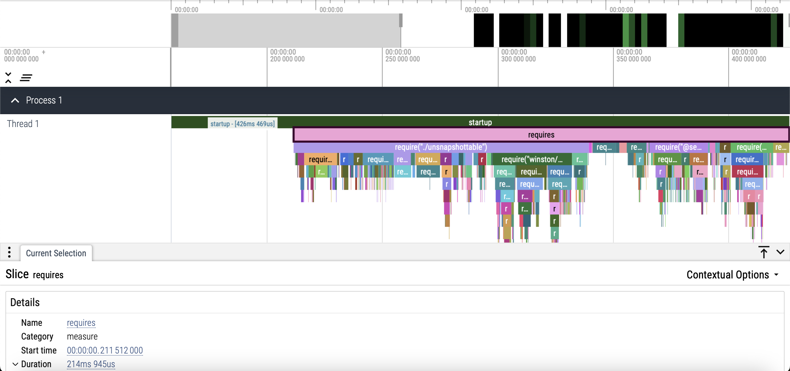
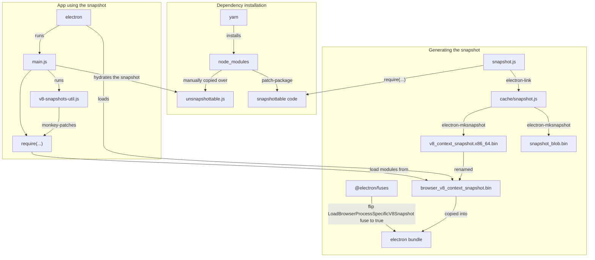
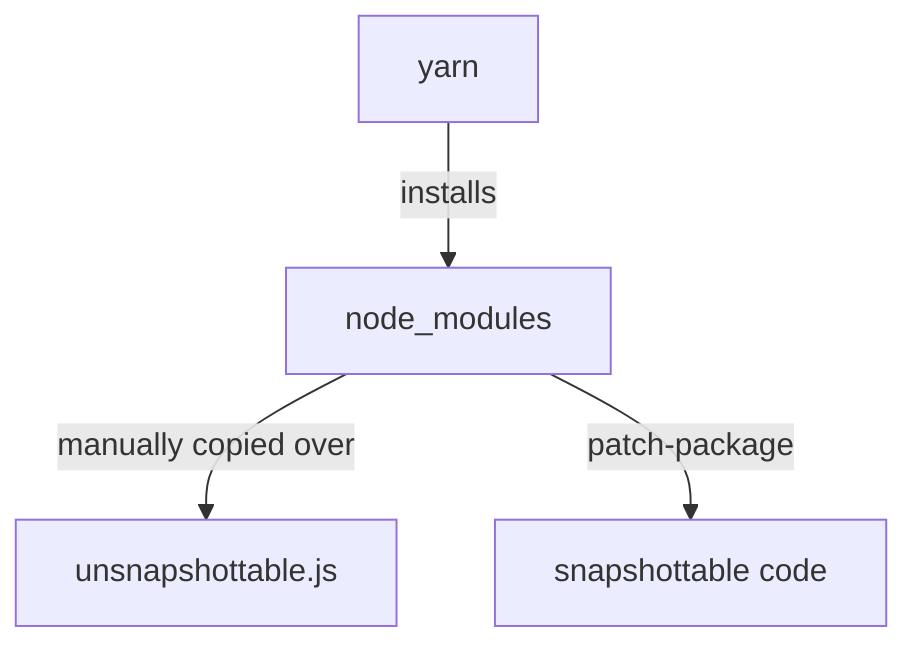
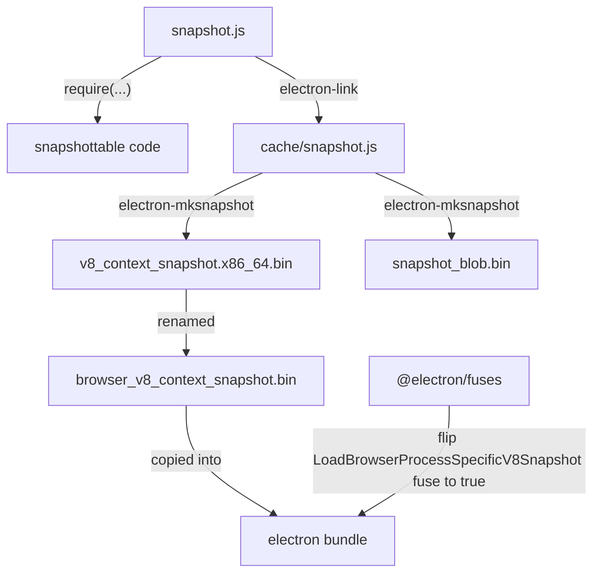
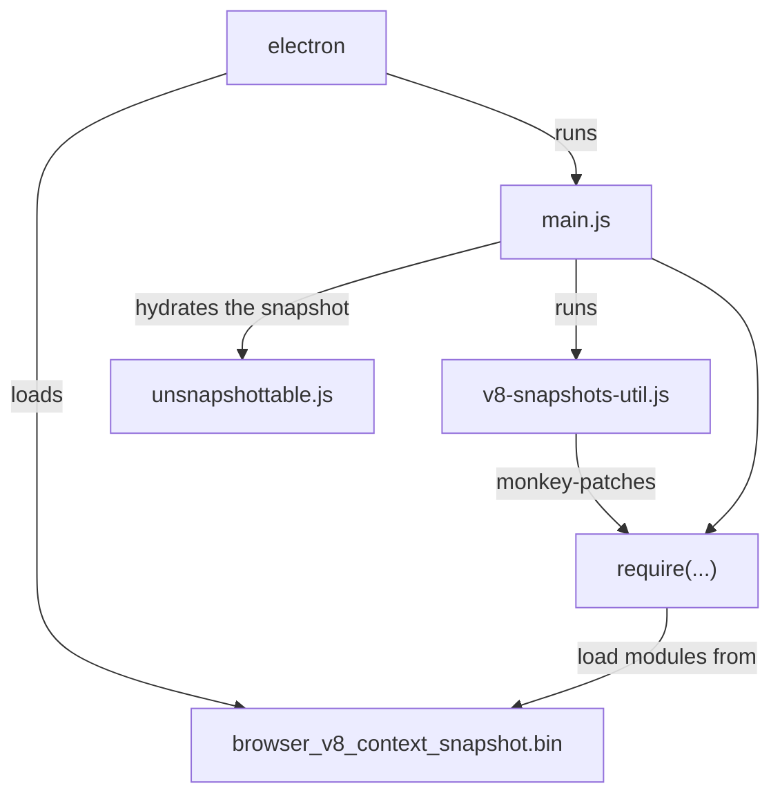

# Electron V8 snapshot experiment

This experiment shows how you can use V8 snapshot to speed up the `require()`s for the main process of your Electron application by **more than 80%!**

(All measurements have been peformed on an `x86_64` macOS running Sonoma `14.6.1`.)

## Before using V8 snapshot



|||
|-|-|
|Total startup time|426ms|
|Total `require()`s time|215ms|
|Electron startup time|211ms|
|Electron binary size|227MB|

## After using V8 snapshot


|||
|-|-|
|Total startup time|272ms|
|Total `require()`s time|41ms|
|Electron startup time|231ms|
|Electron binary size|238MB|

## Results

This has successfully removed 81% of the time spent running all the `require()`s causing an overall 36% performance improvement to the total startup time with minor changes to the Electron startup time and binary sizes!

||Before|After|Difference|% change|
|-|-|-|-|-|
|Total startup time|426ms|272ms|154ms|36%|
|Total `require()`s time|215ms|41ms|174ms|81%|
|Electron startup time|211ms|231ms|-20ms|-10%|
|Electron binary size|227MB|238MB|-11MB|-5%|

## Usage

1. `yarn` - Installs the dependency modules and applies the patches from [`patches`](patches).
2. `yarn use-snapshot` - Generates the V8 snapshot which contains the compilation and execution results of the dependency modules.
3. `yarn start` - Starts the application at improved speed because it uses the V8 snapshot.
4. `yarn reset-snapshot` - Stops using the V8 snapshot.
5. `yarn start` - Starts the application but does not use the V8 snapshot.

## Explanation

[`main.js`](main.js) is the code for a typical Electron application that `require()`s a bunch of JS dependencies, runs some setup code and then opens a window. Of the total 426ms startup time, the `require()`s alone take up 215ms, which is 50%! We can reduce this further by using V8 snapshot.



Let's break this down!

### Dependency installation



When `yarn` is run, it installs the dependencies of the project and also runs the postinstall script to patch the installed packages, so that those could be added to the V8 snapshot.

https://github.com/RaisinTen/electron-snapshot-experiment/blob/e95111b260dfbb7bd17b0ccb499478bbe8e4ef45/package.json#L16

The [V8 snapshot](https://v8.dev/blog/custom-startup-snapshots) is just a serialized heap of V8. During application startup, the V8 heap is deserialized from the snapshot, so that we have the [V8 context](https://v8.dev/docs/embed#contexts) populated with the same JS objects that were present during the snapshot creation. There is an important limitation to V8 snapshots: the snapshot can only capture V8's heap. Any interaction from V8 with the outside is off-limits when creating the snapshot. This includes usage of functionalities from the Node.js or Electron runtime that do not belong to the JS language - things like the `require('http')` builtin module, the global `process` object, etc. To include a dependency module into the V8 snapshot, we need to make sure that executing the module code doesn't require the presence of anything that is not already a part of the JS language.

Executing this code would require the presence of `require()` from Node.js and the https module object, so that it can be monkey-patched. This code cannot be a part of the V8 snapshot because neither of the two are a part of the JS language:

```js
const https = require('https');
https.get = function (_url, _options, cb) {
  // ...
};
```

However, once our Electron app starts running, we would be able to run this code because by then, `require()` and the https module object would be available. This means that to make this script snapshottable, we would need to patch it, so that we can move the unsnapshottable code out of this script and run it during application startup after this script has been deserialized from the V8 snapshot.

When `patch-package` is run, it applies the patches from [`patches`](patches) which removes the unsnapshottable code from the modules. The unsnapshottable code is then moved over to [`unsnapshottable.js`](unsnapshottable.js) which is run during application startup in [`main.js`](https://github.com/RaisinTen/electron-snapshot-experiment/blob/6f2c267c04bc97861e6df1ab409f61f3e2f80c01/main.js#L22).

### Generating the snapshot



The V8 snapshot is generated by running `yarn use-snapshot`.

It executes the [`electron-link`](https://github.com/atom/electron-link) module to generate the `cache/snapshot.js` file from [`snapshot.js`](snapshot.js):

https://github.com/RaisinTen/electron-snapshot-experiment/blob/d683290bef03a8f74f76881937435ef89d4423fa/tools/create-v8-snapshot.js#L10-L24

[`snapshot.js`](snapshot.js) contains code that calls `require()` on all the dependency modules that can be a part of the V8 snapshot. [`electron-link`](https://github.com/atom/electron-link) starts from `snapshot.js` and traverses the entire require graph and replaces all the require calls to the builtin Node.js and Electron modules that cannot be a part of the V8 snapshot in each file with a function that will be called at runtime. The output, `cache/snapshot.js`, contains the code for all the modules reachable from the entry point.

Consider these file contents:

**`snapshot.js`**
```js
require('a');
```

**`node_modules/a/index.js`**
```js
const os = require('os');
exports.os = function () {  return os.version(); };
exports.tmpdir = function () {  return os.tmpdir(); };
```

Passing these through `electron-link` would produce this `cache/snapshot.js`:

```js
// ...
function generateSnapshot () {
  // ...
  function customRequire (modulePath) {
    // Polyfill of Node.js' require() that is used in the V8 snapshot
    // to load the modules from the functions below.
  }
  // ...
    "./snapshot.js": function (exports, module, __filename, __dirname, require, define) {
      require("./node_modules/a/index.js");

    },
    "./node_modules/a/index.js": function (exports, module, __filename, __dirname, require, define) {
      let os;

      function get_os() {
        return os = os || require('os');
      }

      exports.os = function () {  return get_os().version(); };
      exports.tmpdir = function () {  return get_os().tmpdir(); };

    },
  // ...

  // Executes all the module contents and populates customRequire.cache with the exports objects.
  customRequire("./snapshot.js")
  return {
    customRequire,
    setGlobals: function (newGlobal, newProcess, newWindow, newDocument, newConsole, nodeRequire) {
      // Sets the globals in the V8 snapshot with the passed values.
    },
    // ...
  };
}
// ...

// Once the V8 heap gets deserialized from the V8 snapshot, this variable can be directly accessed in the entrypoint script.
var snapshotResult = generateSnapshot.call({})

// ...
```

Executing the contents of the `cache/snapshot.js` script will not depend on anything that is not already a part of the JS language, so the resulting V8 heap at the end of running this script can be snapshotted and it would contain the exports of all the dependency modules.

Then the [`electron-mksnapshot`](https://github.com/electron/mksnapshot) module is used to process the `cache/snapshot.js` script and generate the V8 snapshot:

https://github.com/RaisinTen/electron-snapshot-experiment/blob/d683290bef03a8f74f76881937435ef89d4423fa/tools/create-v8-snapshot.js#L26-L36

It creates the `v8_context_snapshot.x86_64.bin` and `snapshot_blob.bin` files, of which only `v8_context_snapshot.x86_64.bin` is required.

In [`tools/copy-v8-snapshot.js`](tools/copy-v8-snapshot.js), the `v8_context_snapshot.x86_64.bin` file is copied into the electron bundle and renamed to `browser_v8_context_snapshot.bin`. Then the [`@electron/fuses`](https://github.com/electron/fuses) module is used to flip the [`loadBrowserProcessSpecificV8Snapshot`](https://www.electronjs.org/docs/latest/tutorial/fuses#loadbrowserprocessspecificv8snapshot) fuse of the electron binary to `true`, so that during startup, the Electron browser process loads the V8 heap from the `browser_v8_context_snapshot.bin` V8 snapshot file.

### App using the snapshot



The `yarn start` command is used to start the app.

During startup, Electron loads the `browser_v8_context_snapshot.bin` file and deserializes the V8 heap from it. Now, the `snapshotResult` variable which was defined in the `cache/snapshot.js` V8 snapshot script would be available in the current V8 context. Then when Electron starts executing the app code from `main.js`, the [`v8-snapshots-util.js`](v8-snapshots-util.js) script gets run at first.

The `snapshotResult.customRequire.cache` variable is prepopulated with a map of module paths and the exports objects of those modules. Since the `snapshotResult` variable would also be available to the `v8-snapshots-util.js` script, it monkey-patches the `require()` functionality, so that it is optimized to return the module exports object directly from the `snapshotResult.customRequire.cache` map for modules that belong to the V8 snapshot and using the default functionality of compiling and executing the modules from scratch for modules that do not belong to the V8 snapshot:

https://github.com/RaisinTen/electron-snapshot-experiment/blob/e95111b260dfbb7bd17b0ccb499478bbe8e4ef45/v8-snapshots-util.js#L6-L29

Then `v8-snapshots-util.js` calls `snapshotResult.setGlobals()` to replace the polyfilled globals present in the V8 snapshot, like `customRequire()` for `require()`, with the actual ones that are available at runtime, so that when the exported code gets run it uses the actual globals instead of the limited polyfills defined in `cache/snapshot.js`:

https://github.com/RaisinTen/electron-snapshot-experiment/blob/e95111b260dfbb7bd17b0ccb499478bbe8e4ef45/v8-snapshots-util.js#L31-L38

Now that `require()` has been configured to load dependency modules from the V8 snapshot, `main.js` runs [`unsnapshottable.js`](unsnapshottable.js) to execute the parts of those modules that had to be patched because those were not snapshottable.

Finally, the application code is ready to use the dependency modules from the V8 snapshot!

https://github.com/RaisinTen/electron-snapshot-experiment/blob/e95111b260dfbb7bd17b0ccb499478bbe8e4ef45/main.js#L24-L42

### Patches

All the [`patches`](patches) and [`unsnapshottable.js`](unsnapshottable.js) code belong to these categories:

#### Exporting code that inherits from Node.js builtins

If a constructor is exported from a module that inherits from Node.js builtins like `EventEmitter`, it would not be possible to add it to the snapshot:

**`module.js`**
```js
const util = require('util');
const EventEmitter = require('events');

function X() {
  // ...
}

util.inherits(X, EventEmitter);

module.exports = {
  X
};
```

This has been handled by moving the use of the Node.js builtins from the module code into `unsnapshottable.js`:

**`module.js`**
```js
function X() {
  // ...
}

module.exports = {
  X
};
```

**`unsnapshottable.js`**
```js
const util = require('util');
const EventEmitter = require('events');
const { X } = require('module');

util.inherits(X, EventEmitter);
```

Since `require()` uses a cache, modifications to the exported object are persisted across multiple `require()` calls to the same module. Hence, it is possible to make `X` inherit from `EventEmitter` dynamically at runtime when those Node.js builtins are available.

For example, the inheritance logic of the `glob` module has been patched in:

https://github.com/RaisinTen/electron-snapshot-experiment/blob/e95111b260dfbb7bd17b0ccb499478bbe8e4ef45/patches/glob%2B7.2.3.patch#L1-L12

and moved into:

https://github.com/RaisinTen/electron-snapshot-experiment/blob/e95111b260dfbb7bd17b0ccb499478bbe8e4ef45/unsnapshottable.js#L17-L23

#### Exporting classes that inherit from Node.js builtins

We use a similar trick for classes that inherit from Node.js builtins by using `extends` and `super` keywords:

**`module.js`**
```js
const EventEmitter = require('events');

class X extends EventEmitter {
  constructor() {
    super();
    // ...
  }
  // ...
}

module.exports = {
  X
};
```

The module code can be added to the V8 snapshot with the following modifications:

**`module.js`**
```js
const EventEmitter = require('events');

class X {
  constructor() {
    EventEmitter.call(this);
    // ...
  }
  // ...
}

module.exports = {
  X
};
```

**`unsnapshottable.js`**
```js
const EventEmitter = require('events');
const { X } = require('module');

function extendClass(target, base) {
  Object.setPrototypeOf(target, base); // Static properties of base can now be accessed on target.
  Object.setPrototypeOf(target.prototype, base.prototype); // Prototypal properties of base can now be accessed on target.
}

extendClass(X, EventEmitter);
```

Use of `extends` have been substituted with a dynamic class inheritance logic in `unsnapshottable.js` and use of `super` has been replaced with a call to the base class constructor which also passes the `this` object.

For example, the inheritance logic of the `node_modules/ws/lib/websocket-server.js` module has been patched in:

https://github.com/RaisinTen/electron-snapshot-experiment/blob/e95111b260dfbb7bd17b0ccb499478bbe8e4ef45/patches/ws%2B8.9.0.patch#L208-L229

and moved into:

https://github.com/RaisinTen/electron-snapshot-experiment/blob/e95111b260dfbb7bd17b0ccb499478bbe8e4ef45/unsnapshottable.js#L145-L150

#### Re-exporting Node.js builtins

Since Node.js builtins are not a part of the V8 snapshot, those cannot be re-exported from a module belonging to the V8 snapshot:

**`module.js`**
```js
const fs = require('fs');

exports.f = function f() { /* ... */ };
exports.read = fs.read;
exports.write = fs.write;
```

This can be fixed by moving the code for re-exporting the Node.js builtins into `unsnapshottable.js`:

**`module.js`**
```js
exports.f = function f() { /* ... */ };
```

**`unsnapshottable.js`**
```js
const fs = require('fs');
const module = require('module');

module.read = fs.read;
module.write = fs.write;
```

For example, the exports of the `node_modules/nedb/lib/storage.js` module has been patched in:

https://github.com/RaisinTen/electron-snapshot-experiment/blob/e95111b260dfbb7bd17b0ccb499478bbe8e4ef45/patches/nedb%2B1.8.0.patch#L14-L28

and moved into:

https://github.com/RaisinTen/electron-snapshot-experiment/blob/e95111b260dfbb7bd17b0ccb499478bbe8e4ef45/unsnapshottable.js#L57-L68

#### Exporting objects of classes that depend on Node.js builtins

It is not possible to create an object of a class if the construction logic requires Node.js builtins to be present as those are not a part of the V8 snapshot:

**`module.js`**
```js
class X {
  constructor() {
    this.x = process.getActiveResourcesInfo();
  }
};

module.exports = new X();
```

This can be fixed by just exporting the class from the module and then later on in `unsnapshottable.js`, replacing the exports object with an instance of the class:

**`module.js`**
```js
class X {
  constructor() {
    this.x = process.getActiveResourcesInfo();
  }
};

module.exports = X;
```

**`unsnapshottable.js`**
```js
const X = require('module');
require.cache[require.resolve('x')] = new X();
```

For example, the exports of the `node_modules/node-ipc/node-ipc.js` module has been patched in:

https://github.com/RaisinTen/electron-snapshot-experiment/blob/e95111b260dfbb7bd17b0ccb499478bbe8e4ef45/patches/node-ipc%2B9.1.1.patch#L47-L59

and moved into:

https://github.com/RaisinTen/electron-snapshot-experiment/blob/e95111b260dfbb7bd17b0ccb499478bbe8e4ef45/unsnapshottable.js#L152-L158

#### Uses of Buffer and TypedArray in the global scope

Since Buffer is a Node.js builtin and TypedArrays are not supported in V8 snapshots ([since the backing store may be allocated outside of V8](https://v8.dev/blog/custom-startup-snapshots)), those cannot be used in the global scope of snapshotted modules:

**`module.js`**
```js
const b = Buffer.from([1, 2, 3]);

function f() {
  // Do something with b.
}

function g() {
  // Do something with b.
}

exports.f = f;
exports.g = g;
```

This can be fixed by creating the Buffer / TypedArray instances lazily only when needed:

**`module.js`**
```js
let b;
function initB() {
  if (b) return;
  b = Buffer.from([1, 2, 3]);
}

function f() {
  initB();
  // Do something with b.
}

function g() {
  initB();
  // Do something with b.
}

exports.f = f;
exports.g = g;
```

For example, the buffer creation in the `node_modules/ws/lib/permessage-deflate.js` module has been modified into a lazy initialization:

https://github.com/RaisinTen/electron-snapshot-experiment/blob/e95111b260dfbb7bd17b0ccb499478bbe8e4ef45/patches/ws%2B8.9.0.patch#L67-L97

#### Modules that uses or monkey-patches Node.js builtins during module execution

Since Node.js builtins are not a part of the V8 snapshot, those cannot be monkey-patched or used during module execution if it needs to belong to the V8 snapshot:

**`module.js`**
```js
// snapshottable code

const fs = require('fs');
fs.read = function () {
  // ...
};

delete process.env.OLDPWD;

process.on('exit', (code) => {
  console.log('Process exit event with code: ', code);
});
```

This can be fixed by simply moving the problematic code into `unsnapshottable.js`:

**`module.js`**
```js
// snapshottable code
```

**`unsnapshottable.js`**
```js
const fs = require('fs');
fs.read = function () {
  // ...
};

delete process.env.OLDPWD;

process.on('exit', (code) => {
  console.log('Process exit event with code: ', code);
});
```

For example, the code in the `agent-base` module that monkey-patched the Node.js builtins has been removed in:

https://github.com/RaisinTen/electron-snapshot-experiment/blob/e95111b260dfbb7bd17b0ccb499478bbe8e4ef45/patches/agent-base%2B4.3.0.patch#L7

and moved to `unsnapshottable.js` in:

https://github.com/RaisinTen/electron-snapshot-experiment/blob/e95111b260dfbb7bd17b0ccb499478bbe8e4ef45/unsnapshottable.js#L90-L96
