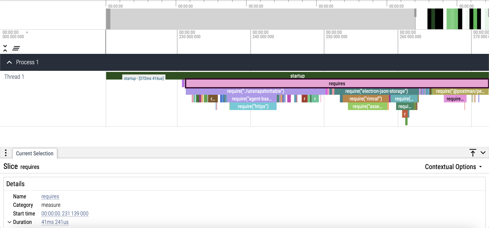

# Electron V8 snapshot experiment

This experiment shows how you can use V8 snapshot to speed up the `require()`s for the main process of your Electron application by **more than 80%!**

(All measurements have been peformed on an `x86_64` macOS running Sonoma `14.6.1`.)

## Before using V8 snapshot


|||
|-|-|
|Total startup time|426ms|
|Total `require()`s time|215ms|
|Electron startup time|211ms|
|Electron binary size|227MB|

## After using V8 snapshot



|||
|-|-|
|Total startup time|272ms|
|Total `require()`s time|41ms|
|Electron startup time|231ms|
|Electron binary size|238MB|

## Results

This has successfully removed 81% of the time spent running all the `require()`s causing an overall 36% performance improvement to the total startup time with minor changes to the Electron startup time and binary sizes!

||Before|After|Difference|% change|
|-|-|-|-|-|
|Total startup time|426ms|272ms|154ms|36%|
|Total `require()`s time|215ms|41ms|174ms|81%|
|Electron startup time|211ms|231ms|-20ms|-10%|
|Electron binary size|227MB|238MB|-11MB|-5%|

## Explanation

[`main.js`](main.js) is the code for a typical Electron application that `require()`s a bunch of JS dependencies, runs some setup code and then opens a window. Of the total 426ms startup time, the `require()`s alone take up 215ms, which is 50%! We can reduce this further by using V8 snapshot.


Let's break this down!

### Dependency installation


When `yarn` is run, it installs the dependencies of the project and also runs the postinstall script to patch the installed packages, so that those could be added to the V8 snapshot.

https://github.com/RaisinTen/electron-snapshot-experiment/blob/e95111b260dfbb7bd17b0ccb499478bbe8e4ef45/package.json#L16

The [V8 snapshot](https://v8.dev/blog/custom-startup-snapshots) is just a serialized heap of V8. During application startup, the V8 heap is deserialized from the snapshot, so that we have the [V8 context](https://v8.dev/docs/embed#contexts) populated with the same JS objects that were present during the snapshot creation. There is an important limitation to V8 snapshots: the snapshot can only capture V8's heap. Any interaction from V8 with the outside is off-limits when creating the snapshot. This includes usage of functionalities from the Node.js or Electron runtime that do not belong to the JS language - things like the `require('http')` builtin module, the global `process` object, etc. To include a dependency module into the V8 snapshot, we need to make sure that executing the module code doesn't require the presence of anything that is not already a part of the JS language.

Executing this code would require the presence of `require()` from Node.js and the https module object, so that it can be monkey-patched. This code cannot be a part of the V8 snapshot because neither of the two are a part of the JS language:

```js
const https = require('https');
https.get = function (_url, _options, cb) {
  // ...
};
```

However, once our Electron app starts running, we would be able to run this code because by then, `require()` and the https module object would be available. This means that to make this script snapshottable, we would need to patch it, so that we can move the unsnapshottable code out of this script and run it during application startup after this script has been deserialized from the V8 snapshot.

When `patch-package` is run, it applies the patches from [`patches`](patches) which removes the unsnapshottable code from the modules. The unsnapshottable code is then moved over to [`unsnapshottable.js`](unsnapshottable.js) which is run during application startup in [`main.js`](https://github.com/RaisinTen/electron-snapshot-experiment/blob/6f2c267c04bc97861e6df1ab409f61f3e2f80c01/main.js#L22).
